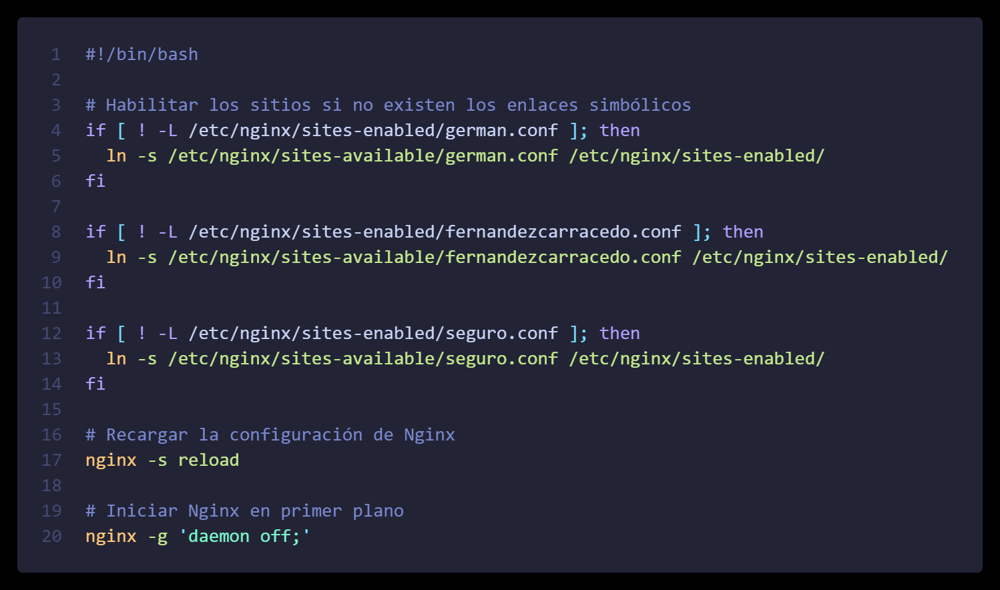
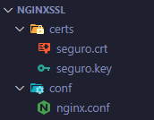

### Despliegue Web en Nginx Server
## Objetivo
El objetivo requerido es la creación de tres hosts virtuales en un servidor Nginx dentro de un contenedor Docker. Cada host debe alojar su propia web:
- Virtual Host 1 (```nombre.com```): Página con nuestro nombre, y una página con una personalización de la página de error 404 

- Virtual Host 2(```www.apellidos.com```): Página con nuestros apellidos y personalización de la página de error 404 

- Virtual Host 3 (```https://seguro.net```): Página con acceso restringido y personalización de las páginas de error: 404, 500, 401 y 403 
    Los datos de acceso serán: 
    - user: nuestro nombre
    - pass: nuestro apellido

## Proceso
1. Creamos un directorio **conf** y creamos el [fichero](./conf/nginx.conf) de configuración nginx.conf.  

        

2. Cada host virtual tendrá su fichero de configuración, en el directorio sites-available, que obtendremos haciendo una copia del fichero ***default*** que Nginx tiene configurado en /etc/nginx/sites-available/ y modificando lo que corresponda.  
He creado una copia en el directorio **sites-available** para tener un host virtual por defecto, y desde ese obtener los ficheros para los hosts que necesito.  
En este caso hemos eliminado las partes que no nos hacen falta y, además, hemos añadido dos líneas para mantener logs de errores y de accesos.  
  
      

Clic en [contenido](./sites-available/german.conf)  para ver el fichero de configuración del primer host.

Para el host que lleva seguridad, se deben añadir mas opciones, para consultarlas, accede al [contenido](./sites-available/seguro.conf) del fichero.

En los ficheros de configuración de los hosts se indican además, las personalizaciones de las páginas que mostrarán los mensajes de error:

  

Podemos ver [aquí](./websites/german.com/errors/404.html) como ejemplo, el código html de uno de estos errores.

El siguiente paso es crear y colocar los ficheros de las páginas de cada host. Se crea un directorio por cada uno, y se centraliza en un directorio llamado **websites**:  

  

Para el host seguro, se ha añadido una carpeta ***privado***, que tendrá contenido con acceso restringido y cuyo nombre hemos indicado en el archivo de configuración del host.

A continuación creamos el fichero docker-compose "***docker-compose.yml***" para configurar el contenedor donde correrá nuestro servidor:

 

Utilizaremos un script para automatizar las tareas que necesitamos para habilitar los hosts virtuales. 

Este script se ejecutará al arrancar el contenedor, al mapear el directorio donde se encuentran nuestros scripts al directorio **/docker-entrypoint.d** del propio contenedor. 

 

Se crean enlaces simbólicos (si no existen ya) del fichero de configuración de cada host virtual en la carpeta ***sites-enabled*** para habilitarlos, se recarga el servidor y se inicia en primer plano.  

También debemos habilitar en el fichero .hosts del sistema las direcciones para nuestros hosts virtuales:

 

Desplegamos nuestro servidor en un contenedor, ejecutando:  
```docker-compose up -d```


### Seguridad

Para la parte de seguridad seguiremos este proceso:
Abrimos la terminal OpenSSL y ejecutamos el siguiente comando, situados en un directorio que debemos crear con el nombre ***certs***. Esto nos generará una clave:  
\
    ```openssl req -x509 -nodes -days 365 -newkey rsa:2048 -keyout seguro.key -out seguro.crt```  
\
    

Estos ficheros **seguro.crt** y **seguro.key** debemos colocarlos en un directorio llamado **certs**:  



Para proteger nuestro directorio ***privado*** del dominio **seguro.net**, primero generaremos una clave con ***Openssl***:  

```openssl passwd```


La asignamos al usuario en el fichero .htpasswd:  


El archivo **.htpasswd** va en el directorio **htpassd**, que al mapearlo en el **docker-compose.yml**, quedaría en el directorio **/etc/nginx/.htpasswd** en nuestro contenedor.  


Una vez hecho esto, ya podemos probar nuestros hosts, escribiendo en nuestro navegador las siguientes direcciones:

- Host nombre: http://german.com:8086  

    
- Host apellidos: http://fernandezcarracedo.com:8086  

    
- Host seguro: https://seguro.net:443  

    
- Carpeta privada en seguro.net: https://seguro.net:443/privado  

    
- Host nombre no encontrado: http://german.com:8086/notfound  

    
- Host apellido no encontrado: http://fernandezcarracedo.com:8086/notfound  

    
- Host seguro no encontrado: http://seguro.net:443/notfound  

    


